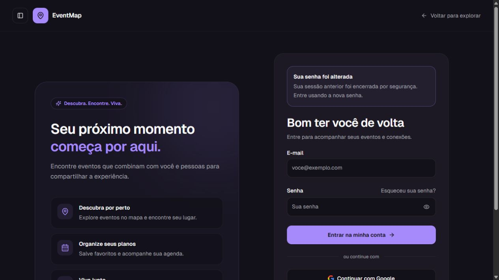

# Validação de recuperação e interface — 03/10/2026

## Executado no navegador real

- Login e cadastro: desktop e mobile, tema claro/escuro, sem sobreposição ou corte horizontal observado.
- Recuperação: desktop, mobile (390 × 844) e tablet (768 × 1024); labels, links e mensagem de erro visíveis.
- SMTP ausente: envio retorna erro útil e botão fica disponível para nova tentativa.
- Redefinição sem token: aviso explícito e campos/botão desabilitados.
- Confirmação de e-mail: formulário acessível no mobile.
- Troca de tema sem autenticação: funcionou pela navegação.
- Descoberta: mapa real carregou; filtros expandidos e roláveis no mobile; largura do documento igual ao viewport (390 px).
- Busca e gratuidade: restauradas após atualizar, a partir da URL; limpar filtros removeu a seleção de gratuidade.
- `/admin` sem sessão: redirecionou para login.
- Aviso `credentials-changed`: exibiu senha alterada, sem confundir com banimento.
- Após reiniciar o servidor de desenvolvimento houve um `ChunkLoadError` em uma aba antiga. Atualizar a página resolveu; a página foi conferida novamente sem esse erro.

## Integração real HTTP/Socket.IO/banco

`node scripts/verify-recovery-http.cjs` passou: rotas públicas, administração negada, validação de origem/corpo, SMTP indisponível com status 503, conexão WebSocket anônima real.

Com autorização específica, `node scripts/verify-password-session-live.cjs --allow-temporary-account` passou na versão final: criou uma conta temporária, autenticou duas sessões e sockets privados, redefiniu a senha pelo handler real, revogou ambas, negou APIs aos cookies antigos, recusou reutilização do token e login com a senha anterior, e aceitou novo login/socket. Somente os registros gerados pelo teste foram removidos. Token de recuperação foi inserido como fixture hash no banco; entrega SMTP não participa deste teste.

`npm run test:password-sessions` também valida que operações do socket revogado são bloqueadas antes do handler, mesmo antes do polling. Regressões de remoção de contas, recuperação, uploads, paginação, filtros, notificações e segurança passaram.

## Limitações

`EMAIL_USER` e `EMAIL_PASS` não estão configurados: não houve envio nem confirmação de recebimento real de e-mail. Falta teste visual autenticado de usuários, notificações e diálogos administrativos. Não alteramos credenciais de contas existentes.

